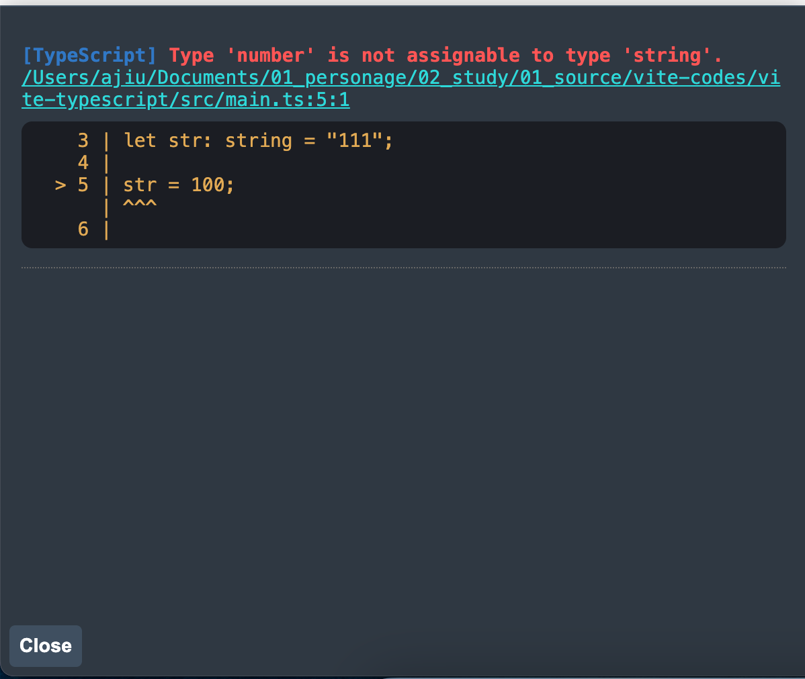

# vite 和 ts 的结合

ts 是 js 的一个类型检查工具 检查我们代码中可能会存在的一些隐性问题 同时给到一些语法提示

## vite-plugin-checker

`vite-plugin-checker`：为`vite`项目添加检查

官网链接：https://vite-plugin-checker.netlify.app/

在`vite.config.ts`中添加过 例如：如果项目中有 ts 的报错 那么会存在一个页面的展示 很醒目 不处理 不能继续下一步

`vite.config.ts`文件配置

```js
import { defineConfig } from "vite";
import checker from "vite-plugin-checker";

export default defineConfig({
  plugins: [
    checker({
      // 开启typescrpt检查
      typescript: true,
    }),
  ],
});
```

结果


### vite build 和 vite-plugin-checker 配合

有一个注意点：如果`vite build`时 项目中仍然存在 ts 的错误 那么项目还是会进行打包 错误也会提示 我们希望如果存在错误 不要进行打包

vite 官网解释：https://www.vitejs.net/guide/features.html#hot-module-replacement

在`package.json`中添加一个命令`tsc --noEmit && vite build` 即`tsc --noEmit`放到`vite build`前面 如果没有报错 即可进行打包操作

### 环境变量提示

vite 文档描述：https://www.vitejs.net/guide/features.html#client-types

**Vite 默认的类型定义是写给它的 Node.js API 的。要将其补充到一个 Vite 应用的客户端代码环境中，请添加一个 d.ts 声明文件：**

创建一个`.d.ts`文件

```ts
/// <reference types="vite/client"/>

interface ImportMetaEnv {
  readonly VITE_PROXY_APP: string;
}
```

会什么会是`ImportMetaEnv` 底层的`import.meta.env`就是这个接口

```ts
interface ImportMetaEnv {
  [key: string]: any;
  BASE_URL: string;
  MODE: string;
  DEV: boolean;
  PROD: boolean;
  SSR: boolean;
}
```

在文件中通过`import.meta.env.`的方式来获取变量名就有提示了
